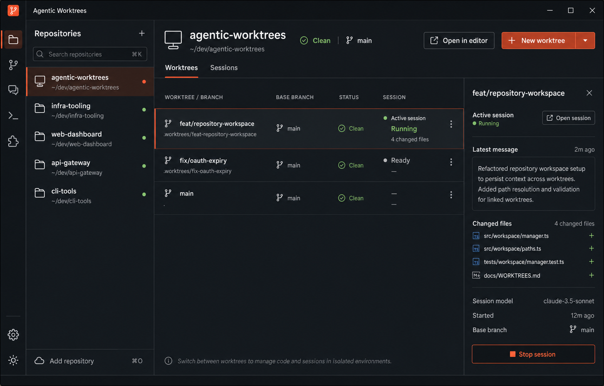
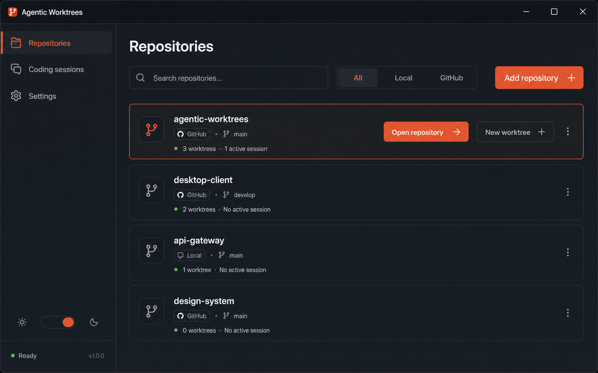

# Repository-first UI concepts

This document captures two navigation directions for reworking the Agentic
Worktrees interface. Both concepts make the repository—not the coding-agent
session—the primary entry point into the product.

These mockups are discussion artifacts. They intentionally stay within the
application's existing user-facing capabilities: selecting or importing a
repository, creating and opening worktrees, opening coding sessions, launching
an editor, and changing settings. Labels, metadata, and secondary controls in
the generated images illustrate hierarchy and are not approved requirements.

## Shared product direction

- Users begin by finding or selecting a repository.
- Worktrees and coding sessions are presented as repository-scoped work.
- The interface stays dense and operational, with clear status and actions.
- Repository, branch, worktree, and session context remain visible when useful.
- Internal orchestration remains hidden unless it directly helps the workflow.
- The visual language uses compact spacing, restrained surfaces, strong
  typography, and a single warm accent color.

## Concept 1: persistent repository workspace

A repository switcher remains visible while the selected repository owns the
main workspace. Users can move between its worktrees and coding sessions
without losing repository context. Selecting a worktree can reveal contextual
details beside the list.

### Strengths

- Fast switching for users who regularly work across several repositories.
- Keeps repository and worktree context visible during operational tasks.
- Supports a compact master-detail workflow with fewer navigation transitions.
- Provides a natural home for repository-scoped session state.

### Trade-offs

- Uses more horizontal space and requires careful behavior at narrow widths.
- Risks becoming visually busy if the repository list and detail panel are both
  expanded.
- Needs a strong hierarchy to prevent the repository and worktree selectors
  from feeling like competing navigation systems.

## Concept 2: repository overview page

The application opens on a calm repository browser. Users search, filter, or
add repositories, then enter a dedicated repository page for worktree and
session work.

### Strengths

- Easy to understand and approachable for first-time users.
- Gives repository discovery and import a clear, focused home.
- Leaves more space inside a repository because the global repository list does
  not remain visible.
- Adapts cleanly to smaller desktop windows.

### Trade-offs

- Switching repositories requires returning to the overview or introducing a
  secondary repository switcher.
- Adds a navigation step for frequent cross-repository work.
- Repository status on the overview can become stale or overloaded if too much
  session detail is added.

## Comparison

| Decision | Persistent workspace | Overview page |
| --- | --- | --- |
| Primary interaction | Select in place | Browse, then enter |
| Cross-repository switching | Immediate | Deliberate |
| Repository context | Always visible | Visible inside its page |
| Horizontal density | Higher | Lower |
| First-use clarity | Good | Strongest |
| Best fit | Frequent multi-repository work | Focused one-repository-at-a-time work |

## Recommendation for discussion

Use the persistent repository workspace as the leading direction if fast
cross-repository work is central to the product. Borrow the overview concept's
search and import experience for an empty state or dedicated repository picker,
rather than keeping two equally prominent navigation models.

The next design decision is whether the repository switcher should remain open
at all times or collapse into a compact rail when a coding session needs more
horizontal space. Implementation should begin only after that navigation model
and the selected concept are approved.

## Alternative HTML mockups

Interactive HTML explorations live under [`docs/mockups/`](./mockups/index.html).
They keep the same visual language and user-facing capabilities as the PNG
concepts above, and probe other navigation models for discussion:

| Concept | File | What it explores |
| --- | --- | --- |
| 3 · Collapsible icon rail | [`mockups/03-collapsible-rail.html`](./mockups/03-collapsible-rail.html) | Hybrid of Concept 1: activity rail + expandable repo flyout + session focus mode (addresses the open rail decision) |
| 4 · Nested tree | [`mockups/04-nested-tree.html`](./mockups/04-nested-tree.html) | Single hierarchical sidebar: repo → worktree → session |
| 5 · Header switcher + palette | [`mockups/05-header-switcher.html`](./mockups/05-header-switcher.html) | Minimal chrome; top repo switcher and ⌘K command palette |

These pages are discussion artifacts only. They do not approve a direction or
change application behavior.
